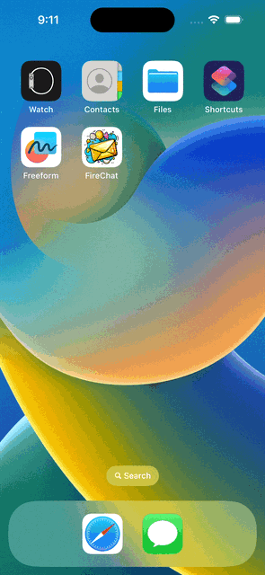

# Firechat

## Overview

Firechat is an internet-based messaging app, similar to WhatsApp, that allows users to send and receive messages in real-time. The app uses Firebase Firestore as a backend database to store and retrieve messages from the cloud. The app also includes user authentication, registration, and login functionality using Firebase.

## Requirements

- Cocoapods
- Firebase account (to use Firebase Firestore and authentication)

you have to add pods below:

```ruby
  pod 'Firebase/Auth'
  pod 'Firebase/Firestore'

``` 


## What I Learned
- Integrated third-party libraries in the app using Cocoapods and Swift Package Manager.
- Stored data in the cloud using Firebase Firestore.
- Queried and sorted data in the Firebase database.
- Used Firebase for user authentication, registration, and login.
- Worked with UITableViews and set their data sources and delegates.
- Created custom views using .xib files to modify native design components.
- Embedded View Controllers in a Navigation Controller and understood the navigation stack.
- Created a constants file and used static properties to store - Strings and other constants.
- Learned about Swift loops and created animations using loops.
- Learned about the App Lifecycle and how to use viewWillAppear or viewWillDisappear.
- Created direct Segues for navigation.

## GIF

<div>

</div>

## Notes
Firebase Firestore is a NoSQL document-based database that stores data in collections and documents.
Use of Firestore requires setting up a Firebase project and configuring the app to use the project's API key.
The app's user interface was designed using native UIKit components and modified using .xib files.
The app's animation was created using Swift loops.
Understanding the App Lifecycle is crucial for creating a responsive and efficient app.